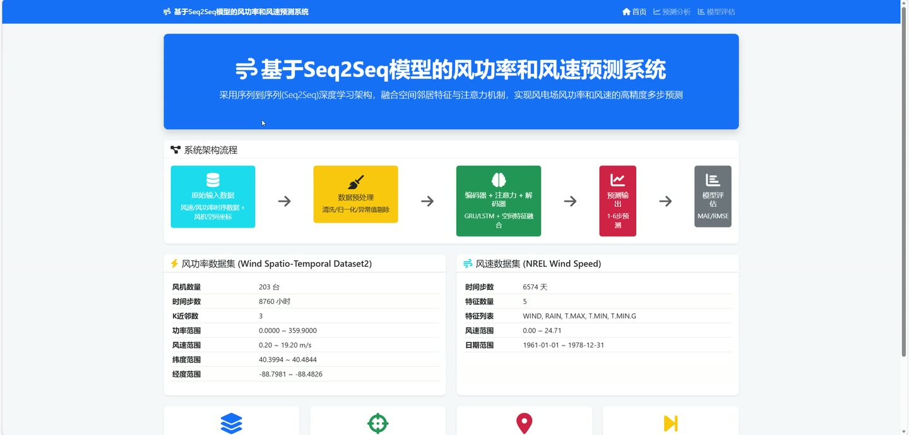
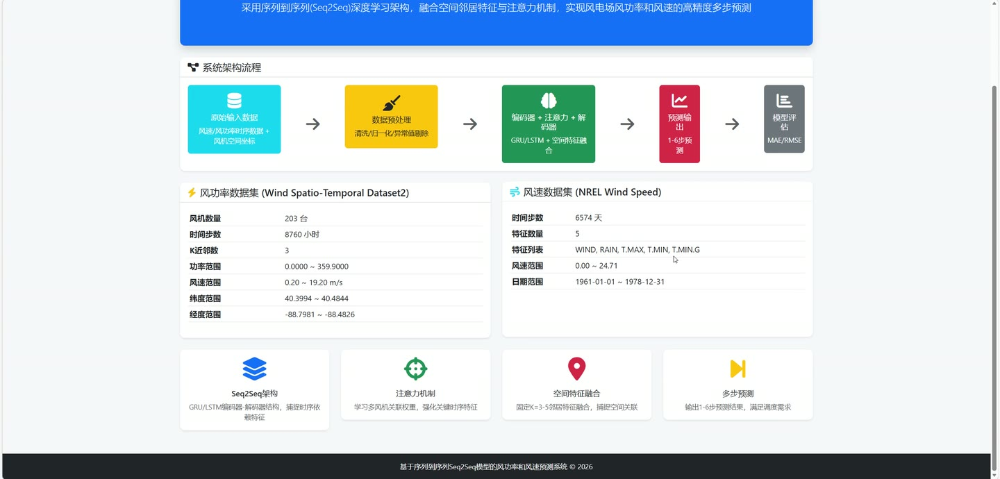
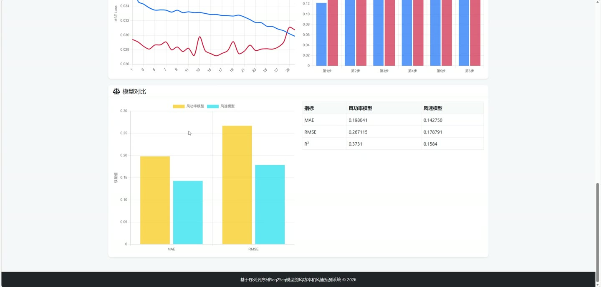
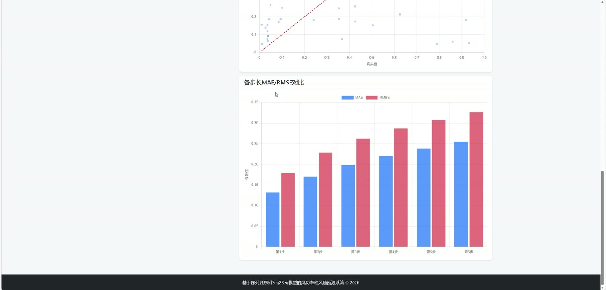
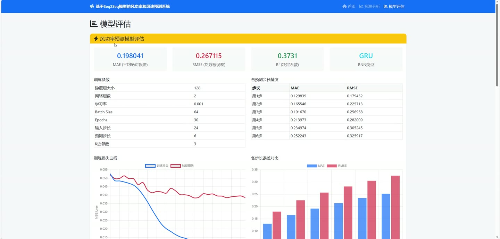
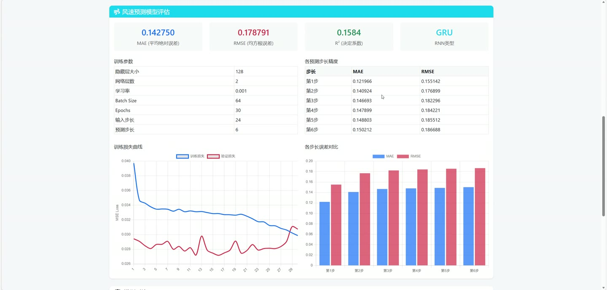

# (附文档)Python+深度学习+PyTorch 基于序列到序列Seq2Seq模型的风功率和风速预测系统

**技术栈**：Python、Flask、PyTorch、深度学习

### 系统简介

本系统是一套基于 Python 与 PyTorch 深度学习框架构建的风功率与风速预测平台，采用前后端分离架构。后端以 Flask 提供 Web 服务与预测接口，核心算法采用序列到序列（Seq2Seq）模型，结合时空特征与邻居风机信息进行多步预测。系统面向普通用户提供数据总览、在线预测与评估结果查看等功能。
 
### 核心功能
 
### 普通用户端

 
- 首页数据总览：展示风功率数据集与风速数据集的统计信息，包括样本数量、特征维度、风机数量等关键指标。 
- 数据集信息查看：分别读取风功率时空数据集与 NREL 风速数据集，呈现各自的数据规模与结构概况。 
- 在线风功率预测：在预测页面选择风功率任务，调用已训练模型对测试集进行推理，返回整体 MAE、RMSE、R2 指标。 
- 在线风速预测：在预测页面选择风速任务，加载风速模型执行推理，输出对应的整体评估指标。 
- 分步指标查看：返回每个预测步长（共 6 步）的逐步评估指标，便于分析多步预测精度衰减情况。 
- 预测结果可视化数据：返回最多 100 条预测值与真实值样本，供前端绘制对比曲线。 
- 模型状态校验：预测前自动检查模型文件是否存在，未训练时返回明确提示信息。 
- 评估结果页面：读取已保存的风功率与风速评估结果 JSON 文件，集中展示历史训练评估数据。 
- 训练历史查看：展示每轮训练的 train_loss、val_loss 与学习率变化记录。 
- 配置参数查看：展示模型训练所用超参数，包括隐藏层维度、层数、序列长度、预测长度等。
 
### 管理员端

 
- 风功率模型训练：调用训练脚本加载风功率数据集，按配置的超参数训练 Seq2Seq 模型。 
- 风速模型训练：加载 NREL 风速数据集，构建并训练风速预测 Seq2Seq 模型。 
- 训练超参数配置：可覆盖默认配置中的 input_size、hidden_size、num_layers、dropout、batch_size、learning_rate、epochs 等参数。 
- 风机编号选择：可指定参与训练的风机编号列表，默认取前 10 台风机。 
- 训练进度回调：训练过程中通过回调函数输出每轮的训练损失与验证损失。 
- 最优模型保存：当验证损失低于历史最优时，自动保存模型权重、配置与轮次信息。 
- 学习率调度：采用 ReduceLROnPlateau 策略，验证损失停滞时自动降低学习率。 
- 梯度裁剪：训练中对模型参数梯度进行裁剪，最大范数设为 1.0，防止梯度爆炸。 
- 测试集评估：训练完成后加载最优权重，在测试集上计算整体与分步评估指标。 
- 结果持久化：将训练历史、评估指标与配置写入 JSON 文件，供评估页面读取。
 
### 技术栈

 开发语言Python Web 框架Flask 深度学习框架PyTorch 核心模型Seq2Seq（GRU 编码器-解码器） 优化器Adam + ReduceLROnPlateau 损失函数MSELoss 数值计算NumPy 数据格式CSV 数据集 + JSON 结果文件 前端渲染Flask Jinja2 模板 接口风格RESTful JSON API
 
### 交付内容

 
- 后端完整源码 
- 前端完整源码 
- 数据库初始化脚本 
- 万字文档

## 界面展示

---

## 获取完整源码 + 万字文档

本仓库为项目介绍页。**完整前后端源码、数据库初始化脚本、万字项目文档**，请加微信 `kangkangcode`，或访问 [codekk.top](http://codekk.top) 获取。

可作课程设计 / 毕业设计参考，支持远程部署调试。